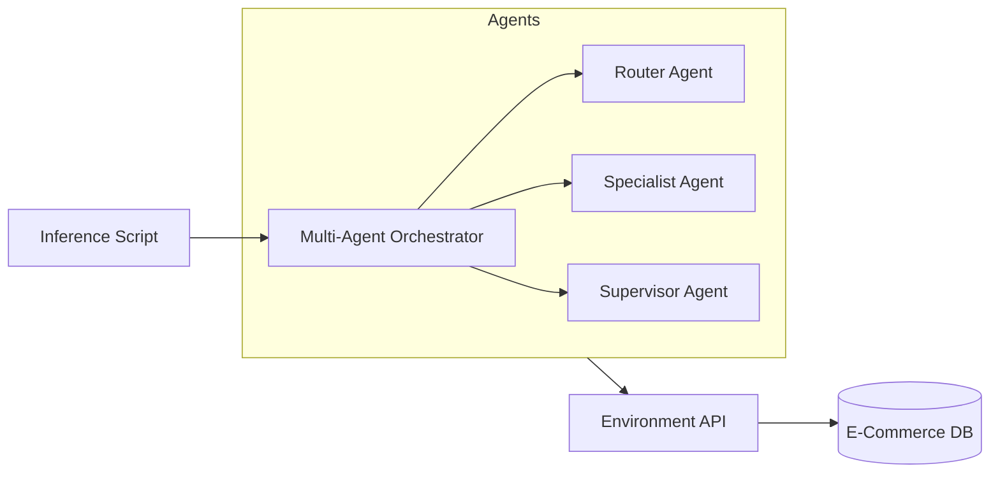

# 🤖 OpenEnv Autonomous Customer Support Agent (CSA)

Welcome to the **OpenEnv CSA** project—a production-grade, multi-agent reinforcement learning environment and agent system. This repository features a decoupled architecture designed for high-performance evaluation and training.

## 📂 Project Structure

```text
.
├── agents/             # Multi-agent reasoning logic (The 'Brain')
│   ├── orchestrator.py # High-level coordination (Router → Specialist → Supervisor)
│   ├── router.py       # Intent classification and urgency detection
│   ├── specialist.py   # Domain-specific tool usage (Order, Logistics, Finance)
│   └── supervisor.py   # Quality control, empathy, and escalation logic
├── server/             # Environment API (The 'World')
│   ├── app.py          # FastAPI application & session-based REST routes
│   ├── db.py           # Comprehensive E-commerce Mock Database (53KB)
│   ├── my_environment.py # Core SupportEnvironment (OpenEnv Spec)
│   └── tools.py        # 17 specialized support tools (Refunds, Tracking, etc.)
├── .env                # Local secrets and configuration (HF_TOKEN)
├── Dockerfile          # Production deployment specification (Hugging Face)
├── inference.py        # Main evaluation entry point (15-Task Suite)
├── openenv.yaml        # OpenEnv submission metadata and entry points
└── README.md           # This file
```

## 🏗️ System Architecture

This project follows a **Decoupled Architecture**, separating the "World" (Environment) from the "Brain" (Agent).

- **The World (Environment)**: A standalone FastAPI server hosted in a Docker container (HF Space). It manages the e-commerce database, tool execution, and rewards.
- **The Brain (Agent)**: A multi-agent orchestrator that runs locally and communicates with the environment via REST API.



## 🚀 Key Features

- **Multi-Agent Reasoning**: A specialized pipeline (Router → Specialist → Supervisor) that prevents "thought loops" and ensures high-quality tool calls.
- **15-Task Evaluation Suite**: 15 distinct e-commerce scenarios across **Easy, Medium, and Hard** difficulty tiers.
- **Autonomous Toolset**: 17 specialized tools for order tracking, refund validation, address changes, and more.
- **53KB Knowledge Base**: A massive, pre-populated database in `server/db.py` ensuring realistic scenarios.
- **RLHF-Ready**: Built-in feedback logging for future Reinforcement Learning from Human Feedback.

## 🛠️ Quick Start

### 1. Setup
Install the dependencies:
```bash
pip install -r requirements.txt
```

### 2. Configuration
Create a `.env` file with your Hugging Face credentials:
```env
HF_TOKEN=your_token_here
ENV_URL=https://darshankumarr03-openenv-csa-rl.hf.space
```

### 3. Run Evaluation
Execute the multi-agent inference script to run the 8-task verification set:
```bash
python inference.py
```

## 🌐 Environment API Specification

The Hugging Face Space provides a session-based REST API for high-performance agent interaction and RL training.

| Endpoint | Method | Description |
| :--- | :--- | :--- |
| `/health` | `GET` | Liveness probe (OpenEnv Validator) |
| `/session/reset` | `POST` | Initialize a session with `session_id` and `task_id` |
| `/session/step/{id}` | `POST` | Execute a tool call/action for a specific session |
| `/session/state/{id}` | `GET` | Retrieve the current full state of the environment |
| `/session/feedback/{id}`| `POST` | Log RLHF feedback (`thumbs_up`/`thumbs_down`) |

## ✅ Validation Status

This project is officially **OpenEnv-compliant** and passes 3/3 validator checks:
1. **Metadata**: Valid `openenv.yaml`.
2. **Environment**: Successfully instantiates the `server` package.
3. **API**: Clean health checks and step-by-step connectivity.

---
**Author**: Darshankumarr03  
**Version**: 2.1.0  
**License**: MIT
