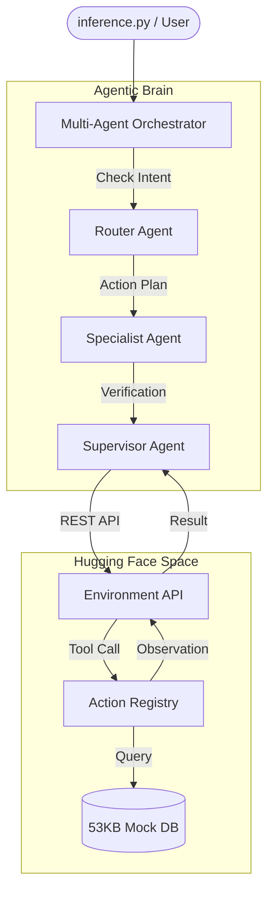

# OpenEnv Customer Support Agent (CSA) RL

[](https://github.com/openenv/openenv)
[](https://huggingface.co/spaces/Darshankumarr03/openenv-csa-rl)

A production-grade, autonomous Customer Support Agent (CSA) built for the **OpenEnv** reinforcement learning competition. This system features a decoupled environment-agent architecture and a high-performance Multi-Agent Orchestrator.

## 🚀 Key Features

- **Decoupled Architecture**: Standalone Environment API served via FastAPI/Uvicorn for high-throughput RL training (GRPO compliant).
- **Multi-Agent Brain**: A hierarchical reasoning pipeline featuring:
  - **Router**: Classifies customer intent and urgency.
  - **Specialist**: Expert execution of support tools (Returns, Refunds, Logistics).
  - **Supervisor**: Quality control and final resolution validation.
- **15-Task Master Suite**: Comprehensive evaluation tasks across Easy, Medium, and Hard tiers, covering:
  - Complex Refunds & Damaged Goods
  - Address Changes & Rescheduling
  - Escalation & Abuse Handling
- **RLHF-Ready**: Built-in feedback logging (`/session/feedback`) for collecting human or automated reinforcement signals.
- **53KB Knowledge Base**: Full mock e-commerce database with real-world scenarios.

## 📐 System Architecture



## 🛠️ Installation & Usage

### 1. Requirements
```bash
pip install -r requirements.txt
```

### 2. Configure Environment
Create a `.env` file with your Hugging Face token:
```env
HF_TOKEN=your_token_here
ENV_URL=https://darshankumarr03-openenv-csa-rl.hf.space
```

### 3. Run Evaluation
Execute the multi-agent inference script across all 15 tasks:
```bash
python inference.py
```

## ✅ Validation Status

This repository passes all **OpenEnv Submission Validator** checks (3/3):
1. [x] **Metadata Validation** (openenv.yaml)
2. [x] **Environment Instantiation** (pyproject.toml scripts)
3. [x] **API Connectivity** (Health Check & Step API)

## 📁 Repository Structure

- `server/`: Root-level Environment API implementation (FastAPI).
- `agents/`: Multi-agent reasoning logic (Router, Specialist, Supervisor).
- `my_env/`: Pydantic models and client-side utilities.
- `Dockerfile`: Production deployment configuration.
- `inference.py`: Main entry point for local evaluation and rollout.

---
**Author**: Darshankumarr03  
**Version**: 2.1.0  
**License**: MIT
